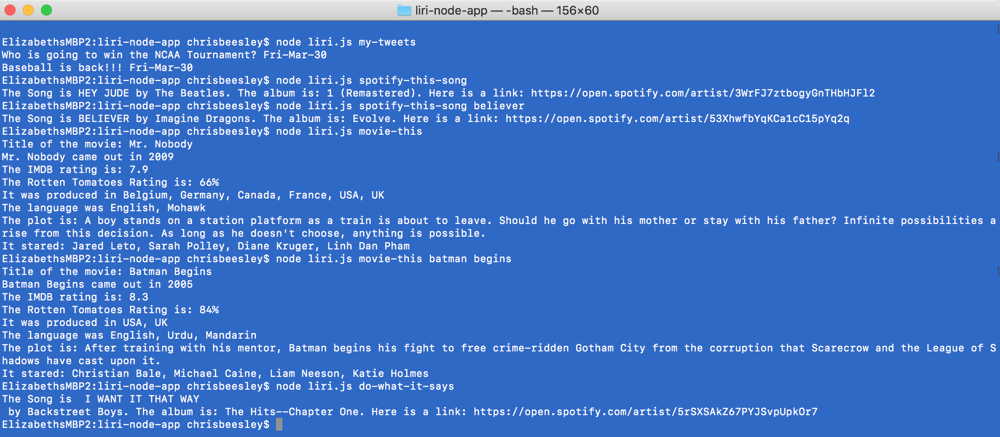

# liri-node-app
Using Node and Javascript I made Liri. Liri can read tweets, tell you about songs, tell you about movies, and do what the .txt file tells it to do. 

# Commands
* `my-tweets`
* `spotify-this-song <song>`
* `movie-this <movie>`
* `do-what-it-says`

# Screenshot

# Technologies 
1. JavaScript
2. Node
3. Twitter API
4. OMDB API
5. Spotify API
